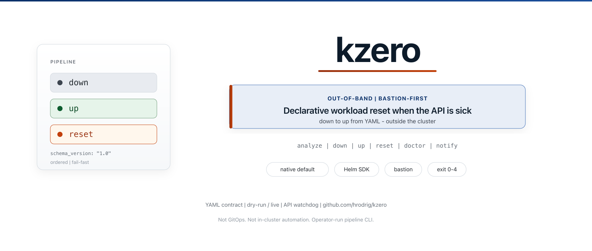

# kzero

<a id="top"></a>

[](https://github.com/hrodrig/kzero/releases)
[](https://github.com/hrodrig/kzero/releases)
[](https://go.dev/dl/)
[](./LICENSE)
[](https://deepwiki.com/hrodrig/kzero)
[](https://github.com/hrodrig/kzero/actions/workflows/ci.yml)
[](https://codecov.io/gh/hrodrig/kzero)
[](https://gghstats.hermesrodriguez.com/hrodrig/kzero)
[](https://pkg.go.dev/github.com/hrodrig/kzero)
[](https://goreportcard.com/report/github.com/hrodrig/kzero)
[](https://deps.dev/go/github.com%2Fhrodrig%2Fkzero)
[](https://github.com/hrodrig/kzero/actions/workflows/security.yml)
[](https://github.com/hrodrig/kzero/actions/workflows/codeql.yml)


**Repo:** [github.com/hrodrig/kzero](https://github.com/hrodrig/kzero) · **Releases:** [Releases](https://github.com/hrodrig/kzero/releases) · **DeepWiki:** [hrodrig/kzero](https://deepwiki.com/hrodrig/kzero)

*Badges:* **Version** is a static badge aligned with the repo **`VERSION`** file (next release target). **GitHub release** shows the latest published **tag** on GitHub; it can lag the **`VERSION`** file until a release is cut. **Go** matches **`go.mod`**. **License** points at this repository’s license file. **Ask DeepWiki** links to [DeepWiki](https://deepwiki.com/) AI-generated docs for this repository (see also [badge maker](https://deepwiki.com/badge-maker)). **CI**, **Security**, and **CodeQL** reflect [GitHub Actions](https://github.com/hrodrig/kzero/actions) workflows. **codecov** tracks coverage uploaded from CI. **pkg.go.dev**, **Go Report Card**, and **deps.dev** summarize the Go module and dependencies. **gghstats clones** shows Git clone traffic for this repo (see [gghstats](https://github.com/hrodrig/gghstats)).



<a id="terminal-demo"></a>
**Terminal demo** (recorded with [VHS](https://github.com/charmbracelet/vhs); source [`docs/demo.tape`](docs/demo.tape), config [`docs/demo-kzero.yaml`](docs/demo-kzero.yaml)):


Regenerate from the repo root: **[docs/README.md — Terminal demo](docs/README.md#terminal-demo-vhs)**.

Declarative **Kubernetes workload** orchestration: ordered **down** / **up** (and **reset**) pipelines from YAML, with phase hooks, optional **per-step** `pre` / `post` scripts, workload scale steps, **Helm releases** (shell scripts or **Helm SDK** chart manifests under **`helm.workspace`**), **`pvc`** / **`exec`** API steps, and **`custom:`** scripts.

**Operator deployment (bastion, cron, kind e2e, full-reset examples):** **[kzero-selfhosted](https://github.com/hrodrig/kzero-selfhosted)** — production paths and annotated profiles live there; **this** repo ships the CLI binary, packages, container image, and Homebrew cask only (same split as [pgwd](https://github.com/hrodrig/pgwd) / [pgwd-selfhosted](https://github.com/hrodrig/pgwd-selfhosted)).

**Releases** ([GitHub Releases](https://github.com/hrodrig/kzero/releases)) ship standalone **binaries** and archives (**`.tar.gz`** / **`.zip`**), Linux **`.deb`** / **`.rpm`**, **Docker** images on **`ghcr.io/hrodrig/kzero`**, and **Homebrew** ([`brew install hrodrig/kzero/kzero`](#homebrew-macos--linux)). **Supply chain (v0.7.0+):** each release attaches **SPDX** and **CycloneDX** SBOMs plus **Cosign** signatures for **`checksums.txt`** and GHCR images — verify with **`cosign verify-blob`** / **`cosign verify`** (see release assets). This repository does **not** ship Helm charts as a release artifact.

Behavior, schema, and acceptance criteria are defined in **[docs/SPECIFICATIONS.md](docs/SPECIFICATIONS.md)**. **Planned work** (prioritized): **[docs/ROADMAP.md](docs/ROADMAP.md)** — next band **[0.8.x](docs/plan-0.8.x.md)** (API watchdog, notify delivery visibility for long live **`reset`** on bastions). **Operator mitigations today:** [docs/examples/pipeline-network-loss.md](docs/examples/pipeline-network-loss.md). **Diagrams** (Mermaid): **[docs/diagrams.md](docs/diagrams.md)**.

## Table of contents

- [Terminal demo](#terminal-demo)
- [Features](#features)
- [Requirements](#requirements)
- [Install or update](#install-or-update)
- [Operator deployment](#operator-deployment)
- [Quick start](#quick-start)
- [First run](#first-run)
- [Usage examples](#usage-examples)
- [Configuration reference](#configuration-reference)
- [Environment and precedence](#environment-and-precedence)
- [Troubleshooting](#troubleshooting)
- [Security note](#security-note)
- [Releases and CI](#releases-and-ci)
- [Development](#development)
- [Per-step `pre` / `post` (example)](#per-step-pre-post-example)
- [Pipeline order and integrity on `down`](#pipeline-order-and-integrity-on-down)
- [Get involved](#get-involved)
- [License](#license)

---

## Features

- **Configuration-first** (`schema_version: "1.0"`): pipelines and hooks live in config, not hardcoded playbooks.
- **Commands**: `analyze`, `target`, `notify test`, `verify`, `probe`, `down`, `up`, `reset`, `version` — global **`--log-format text|json`** and **`--log-level`** on pipeline output (see SPEC). (`reset` = full `down` then `up`; if `down` fails, `up` does not run). Every pipeline command prints a **`Kubernetes target:`** block (`started_at`, optional `client_id`, context, cluster, API server, kubeconfig path) before work starts. **`kzero notify test`** verifies outbound **`notify.*`** channels without running a pipeline. **`analyze`** optionally checks the API that each `deployment` / `statefulset` in the plan exists when kubeconfig loads.
- **Phase hooks**: `pre-down`, `post-down`, `pre-up`, `post-up`, `on-error` (shell script paths).
- **Per-step hooks** (`pre` / `post`): optional shell scripts for a **single** pipeline step—run immediately before and after that step’s main action; **`post` runs only if the main action succeeds**.
- **Step types**: compact refs (`deployment.ns/name`, `statefulset.ns/name`, `pvc.ns/claim`, `exec.ns/pod`), `release.ns/name` (**Helm SDK** chart manifest **`<release>.yaml`** or legacy **`<release>.sh`** under `helm.workspace`), and `custom: ./script.sh` (with optional sibling `pre` / `post` keys on the same YAML mapping). DaemonSet is **not** supported as a built-in kind because `kubectl scale` rejects it (no `/scale` subresource); use a `custom:` step with `kubectl patch` to set a `nodeSelector` that drains the pods.
- **`run.execution`**: **`shell`** (default — **`kubectl`** / **`helm`** subprocesses), **`native`** (client-go scale + **Helm SDK** + API **`pvc`** / **`exec`**), or **`auto`** (native with shell fallback). Recommended for distroless / in-cluster Jobs: **`native`** — see [SPEC — `run.execution`](docs/SPECIFICATIONS.md#workload-execution-backend-runexecution).
- **Run modes**: `dry-run` (plan only, no cluster mutations) and `live`.

**Libraries** (see [`go.mod`](go.mod)): [Cobra](https://github.com/spf13/cobra) **v1.10.2**, [Viper](https://github.com/spf13/viper) **v1.21.0**.

[↑ Back to top](#top)

## Requirements

Host tooling depends on **`run.execution`** and your pipeline step types (see [SPECIFICATIONS.md](docs/SPECIFICATIONS.md)):

| Path | Host tools |
|------|------------|
| **`run.execution: shell`** (default) | **`kubectl`** on `PATH` (or **`command.kubectl`**); **`helm`** when using **`release.*`** shell scripts |
| **`run.execution: native`** / **`auto`** | Valid **kubeconfig** (or in-cluster SA); **no host `kubectl`** for scale/wait/**`pvc`**/**`exec`**/**Helm SDK** **`release.*`** |
| Phase hooks, **`custom:`**, per-step **`pre`/`post`** | **`/bin/sh`**; scripts often call **`kubectl`** themselves |

- **RBAC** sufficient for the operations in your pipelines (for example **`get`/`patch`/`scale`**, PVC delete, Helm releases, pod exec)
- **Go 1.26.4+** if you [build from source](#quick-start) (`make build`) or use [`go install`](#install-with-go)

[↑ Back to top](#top)

## Install or update

Pre-built **`.deb`**, **`.rpm`**, **`.tar.gz`** (and **`.zip`** on Windows), plus **multi-arch** container images on **`ghcr.io/hrodrig/kzero`**, are on **[GitHub Releases](https://github.com/hrodrig/kzero/releases)** and **[latest release](https://github.com/hrodrig/kzero/releases/latest)**. The **release** badge at the top of this README shows the current tag at a glance.

**Why not a single `latest` URL for every file?** GitHub’s `…/releases/latest/download/<file>` only works if the **asset filename is identical** on every release. GoReleaser here uses the **git tag (with `v`)** in Linux package and archive basenames (for example **`kzero_v0.7.3_linux_amd64.deb`**), while the download path is still `…/download/v0.7.3/…`. **Pick names from the release page**, use the **snippet below**, or use the **badge**.

### Install latest `.deb` (Debian / Ubuntu, `amd64`)

```bash
# Latest published release tag (python3 or jq). Linux .deb basename includes the tag WITH "v".
TAG="$(curl -fsSL https://api.github.com/repos/hrodrig/kzero/releases/latest | python3 -c 'import json,sys; print(json.load(sys.stdin)["tag_name"])')"
# Alternative: TAG="$(curl -fsSL https://api.github.com/repos/hrodrig/kzero/releases/latest | jq -r .tag_name)"

[ -n "$TAG" ] || { echo "Could not resolve tag (empty). Install python3 or jq, or set TAG manually from the Releases page." >&2; exit 1; }

DEB="kzero_${TAG}_linux_amd64.deb"
URL="https://github.com/hrodrig/kzero/releases/download/${TAG}/${DEB}"
TMP="/tmp/${DEB}"

# Download to /tmp so user _apt can read the file (apt often cannot read ~/.deb when $HOME is mode 700).
if ! curl -fsSL "$URL" -o "$TMP"; then
  echo "Download failed (curl exit $?). Check URL: $URL" >&2
  exit 1
fi
if [ ! -f "$TMP" ]; then
  echo "Expected $TMP after download — not found." >&2
  exit 1
fi
sudo apt install "$TMP"
```

Paste the block **as a whole**, or chain with `&&`, so **`apt` does not run** after a failed **`curl`**. **`curl -f`** (via `-fsSL`) exits non‑zero on HTTP errors (404, etc.).

**`apt` + `_apt` / “Permission denied” under `$HOME`:** if you `curl` the `.deb` into **`~`** and run `sudo apt install ./kzero_….deb`, Debian/Ubuntu may warn that **`_apt` cannot read the file** (home directory not world-executable). Use **`/tmp`** as above, or `sudo cp "$DEB" /tmp/` then `sudo apt install "/tmp/$DEB"`.

**Empty `TAG`:** if `jq`/`python3` failed, you get `.../download//kzero__linux_amd64.deb` and a broken filename.

**`.deb` / `.rpm`** install **`kzero`** to **`/usr/bin`** and place **`/etc/kzero/kzero.yaml`** (from the sample; **`config|noreplace`** on upgrades). The CLI defaults to **`./kzero.yaml`** when **`--config`** is omitted—use **`kzero --config /etc/kzero/kzero.yaml …`** after install, or copy that file to **`./kzero.yaml`**. Use **`linux_arm64`** in the download filename on ARM64 Linux.

### Fixed-tag examples (copy from the release page if you prefer)

| Format | Example (tag **`v0.7.3`** in the URL path; artifact basename includes the same **`v0.7.3`**) |
|--------|------------------------------------------------------------------|
| **`.deb`** | `curl -fsSL -o /tmp/kzero_v0.7.3_linux_amd64.deb https://github.com/hrodrig/kzero/releases/download/v0.7.3/kzero_v0.7.3_linux_amd64.deb` then `sudo apt install /tmp/kzero_v0.7.3_linux_amd64.deb` |
| **`.rpm`** | `curl -fsSLO https://github.com/hrodrig/kzero/releases/download/v0.7.3/kzero_v0.7.3_linux_amd64.rpm` then `sudo rpm -Uvh kzero_v0.7.3_linux_amd64.rpm` or `sudo dnf install ./kzero_v0.7.3_linux_amd64.rpm` |
| **`.tar.gz` (Linux)** | `curl -fsSLO https://github.com/hrodrig/kzero/releases/download/v0.7.3/kzero_v0.7.3_linux_amd64.tar.gz` then `tar xzf kzero_v0.7.3_linux_amd64.tar.gz` and run **`./kzero`** from the extracted tree (see **`share/examples/kzero/kzero.sample.yml`**) |
| **`.tar.gz` (macOS)** | `curl -fsSLO https://github.com/hrodrig/kzero/releases/download/v0.7.3/kzero_v0.7.3_darwin_amd64.tar.gz` (or **`…_darwin_arm64.tar.gz`** on Apple silicon) |

**Update:** download a newer release and run the same install command again (`rpm -Uvh`, `apt install` over the `.deb`, or replace the tarball tree).

**Windows:** use the **`.zip`** asset for your arch (for example **`kzero_v0.7.3_windows_amd64.zip`**), unpack, run **`kzero.exe`** where **`kubectl`** is available.

**Docker:** `docker pull ghcr.io/hrodrig/kzero:v0.7.3` (match the image tag to the **[release](https://github.com/hrodrig/kzero/releases)** you want). Published images use **`gcr.io/distroless/static-debian12:nonroot`** (static **`kzero`** binary only: no shell, no BusyBox/Alpine runtime). **`Dockerfile`** in this repo uses the same final stage. Package: [ghcr.io/hrodrig/kzero](https://github.com/hrodrig/kzero/pkgs/container/kzero).

**Homebrew** and **BSD packaging** helpers: see **[Install or update](#install-or-update)** and **`contrib/README.md`**.

### Homebrew (macOS / Linux)

```bash
brew install hrodrig/kzero/kzero
```

Tap: **[hrodrig/homebrew-kzero](https://github.com/hrodrig/homebrew-kzero)** (cask updated automatically on each release).

Then run **`kzero --config /etc/kzero/kzero.yaml analyze`** (or follow **[Quick start](#quick-start)** to build from a clone).

[↑ Back to top](#top)

## Quick start

```bash
make build
./bin/kzero --help
./bin/kzero analyze --config configs/kzero.sample.yml
```

On FreeBSD, use **`gmake`** (or plain `make`, which forwards to GNU Make via the stub **Makefile**).

Copy and edit `configs/kzero.sample.yml` (or use `--config` / `./kzero.yaml`). Override values via environment variables with the `KZERO_` prefix (see Viper / sample file comments).

If you installed from **[Releases](#install-or-update)** or **`go install`** (below), use **`kzero`** on your `PATH` instead of **`./bin/kzero`**.

### Install with Go

From any machine with Go **1.26.4+** (installs to `$(go env GOPATH)/bin`; ensure that directory is on your `PATH`):

```bash
go install github.com/hrodrig/kzero/cmd/kzero@latest
```

Use a **release tag** instead of `@latest` if you want a pinned version (for example `@v0.7.3`). Module reference: [pkg.go.dev/github.com/hrodrig/kzero](https://pkg.go.dev/github.com/hrodrig/kzero).

**End-to-end operator profile** (maintenance reset: truncate, Helm infra, PVC wipe, **`infra_probe`**, notify): **[kzero-selfhosted — full-reset-example](https://github.com/hrodrig/kzero-selfhosted/tree/main/run/examples/full-reset-example)** with [validation runbook](https://github.com/hrodrig/kzero-selfhosted/blob/main/run/docs/full-reset-validation.md).

[↑ Back to top](#top)

## First run

kzero reads **one YAML file** per invocation (default **`./kzero.yaml`**; after a `.deb`/`.rpm` install use **`kzero --config /etc/kzero/kzero.yaml`**).

1. Start from **[`configs/kzero.sample.yml`](configs/kzero.sample.yml)** (clone, release tarball, or **`/etc/kzero/kzero.yaml`**).
2. Keep **`run.mode: dry-run`** until **`kzero analyze`** matches expectations; see [SPECIFICATIONS.md](docs/SPECIFICATIONS.md).

```bash
cp configs/kzero.sample.yml kzero.yaml
kzero analyze
kzero down    # dry-run when run.mode: dry-run
```

For **bastion**, **cron**, **CI**, and **live** patterns: **[kzero-selfhosted](https://github.com/hrodrig/kzero-selfhosted)** → [run/README.md](https://github.com/hrodrig/kzero-selfhosted/blob/main/run/README.md). For a **full platform reset** playbook (hooks, Helm SDK manifests, transcripts): [full-reset-example](https://github.com/hrodrig/kzero-selfhosted/tree/main/run/examples/full-reset-example).

[↑ Back to top](#top)

## Operator deployment

| Goal | Start here |
|------|------------|
| **Full platform reset** (truncate, PVC, Helm SDK, probe) | [kzero-selfhosted/run/examples/full-reset-example/](https://github.com/hrodrig/kzero-selfhosted/tree/main/run/examples/full-reset-example) · [validation runbook](https://github.com/hrodrig/kzero-selfhosted/blob/main/run/docs/full-reset-validation.md) |
| **Bastion / cron / systemd** | [kzero-selfhosted/run/](https://github.com/hrodrig/kzero-selfhosted/tree/main/run) — [standalone](https://github.com/hrodrig/kzero-selfhosted/blob/main/run/standalone/README.md), [automation & CI](https://github.com/hrodrig/kzero-selfhosted/blob/main/run/docs/automation-and-pipelines.md) |
| **Network loss during live reset** | [pipeline-network-loss.md](docs/examples/pipeline-network-loss.md) — mitigations until **v0.8.0**; [plan-0.8.x.md](docs/plan-0.8.x.md) |
| **`docker run`** (analyze / version; live limits) | [run/docker/README.md](https://github.com/hrodrig/kzero-selfhosted/blob/main/run/docker/README.md) |
| **kind e2e** smoke | [testing/kind/README.md](https://github.com/hrodrig/kzero-selfhosted/blob/main/testing/kind/README.md) |
| **Reference hooks & probe assets** | [run/examples/](https://github.com/hrodrig/kzero-selfhosted/tree/main/run/examples) |

Install the **CLI** here ([Install or update](#install-or-update)); run it from a host with **kubeconfig** and the tools your YAML requires (**`kubectl`** / **`helm`** on the shell path; **`native`** reduces host dependencies — see [Requirements](#requirements)).

[↑ Back to top](#top)

## Usage examples

Paths use **`./bin/kzero`** after `make build`. If you installed from **[Releases](#install-or-update)** or **`go install`**, use **`kzero`** on your `PATH` the same way.

### Plan only (`analyze`, `down` / `up` in `dry-run`)

```bash
kzero analyze --config ./kzero.yaml
# With run.mode: dry-run in YAML:
kzero down --config ./kzero.yaml
```

**`analyze`** validates the profile and prints the normalized plan on stdout: run metadata, phase hooks, indexed **`[down]`** / **`[up]`** steps (including release script paths and per-step options), and a **Deferred** block when unimplemented schema fields are set. See [docs/SPECIFICATIONS.md](docs/SPECIFICATIONS.md) → **`kzero analyze`**.

### Test notifications (no pipeline)

```bash
kzero notify test --config ./kzero.yaml
kzero notify test -c ./kzero.yaml --event pipeline.error
```

Verifies **`notify.*`** channels without contacting the API or running **`down`** / **`up`**. Full cookbook: [docs/examples/notifications.md](docs/examples/notifications.md).

### Readiness verify (post-up)

```bash
kzero verify --config ./kzero.yaml
kzero verify -c ./kzero.yaml --log-format json
```

Set **`run.verify: true`** to run verify automatically after a successful **`up`** or **`reset`** in **`live`** mode.

### Infra probe (pre-destructive gate)

```bash
kzero probe --config ./kzero.yaml
```

Optional **`infra_probe`** runs a throwaway mini-pipeline before **`down`** / **`reset`** in **`live`** mode. Cookbook: [docs/examples/infra-probe.md](docs/examples/infra-probe.md). Reference Redis assets: [kzero-selfhosted/run/examples/infra-probe/](https://github.com/hrodrig/kzero-selfhosted/tree/main/run/examples/infra-probe).

### Explicit config path

```bash
kzero analyze --config /path/to/prod/kzero.yaml
kzero up --config /path/to/prod/kzero.yaml
```

### `reset` (`down` then `up`)

```bash
kzero reset --config ./kzero.yaml
```

If **`down`** fails, **`up`** is **not** executed (see [`RunReset`](https://github.com/hrodrig/kzero/blob/main/internal/engine/engine.go#L44)).

### Automation and CI/CD

Cron, GitHub Actions, and YES-gated wrappers: **[kzero-selfhosted/run/docs/automation-and-pipelines.md](https://github.com/hrodrig/kzero-selfhosted/blob/main/run/docs/automation-and-pipelines.md)**.

### Version metadata

```bash
kzero version
```

[↑ Back to top](#top)

## Configuration reference

Full schema, validation, and acceptance criteria: **[docs/SPECIFICATIONS.md](docs/SPECIFICATIONS.md)**. Annotated sample: **[configs/kzero.sample.yml](configs/kzero.sample.yml)**.

| Block / key | Purpose |
|-------------|---------|
| **`schema_version`** | Must be **`1.0`** today. |
| **`cluster`** | Metadata (`name`, `environment`, …) for labels and notifications. |
| **`helm`** | **`workspace`**: directory of **`<release>.yaml`** Helm SDK chart manifests (recommended with **`run.execution: native`**) and/or legacy **`<release>.sh`** scripts; optional **`registries`** for OCI login. |
| **`command`** | Optional paths for **`kubectl`** and **`helm`**. |
| **`hooks`** | Optional global scripts: **`pre-down`**, **`post-down`**, **`pre-up`**, **`post-up`**, **`on-error`**. |
| **`notify`** | Optional outbound alerts: **`slack`**, **`discord`**, **`teams`**, **`pagerduty`**, **`webhook`**; fires on pipeline start/success/error in **`live`** mode. Test with **`kzero notify test`** (see [docs/examples/notifications.md](docs/examples/notifications.md)). |
| **`pipelines`** | See [`pipelines`](#pipelines) below. |
| **`retry`** | See [`retry`](#retry) below. |
| **`run`** | See [`run`](#run) below. |

### `run`

| Key | Purpose |
|-----|---------|
| **`mode`** | **`dry-run`** (log plan only) or **`live`** (execute steps). Required. |
| **`execution`** | **`shell`**, **`native`**, or **`auto`** — see [Features](#features) and SPEC. |
| **`timeout`** | Wall-clock budget for a full **`down`**, **`up`**, or **`reset`** (Go duration, e.g. **`25m`**). |
| **`kubeconfig`** | Path passed to **`kubectl`** / **`helm`**; empty uses the process environment / default kubeconfig search. |
| **`operation_timeout`** | Per-operation ceiling (e.g. **`45s`**) for individual kubectl/helm calls inside a step. |

Pipeline steps always run **sequentially** in YAML order (no parallel execution). On **`down`**, workload steps scale to **0** without waiting for pods to exit unless you add per-step **`post`** (or **`pre`** on the next step). See [Pipeline order and integrity on `down`](#pipeline-order-and-integrity-on-down) and [SPEC — Current engine](docs/SPECIFICATIONS.md#current-engine-sequencing-retry-and-concurrency).

### `retry`

| Key | Purpose |
|-----|---------|
| **`attempts`** | Total tries per pipeline step in **`live`** mode (**integer**, minimum effective **1**). |
| **`delay`** | Base wait before the first retry (**Go duration**, e.g. **`8s`**); after failure *n*, wait **`delay × 2^(n−1)`** (capped at **2m**; default base **5s** if `delay` is zero). |

Retries rerun the whole step (per-step **pre**, main, **post**). Only **transient** failures retry (API timeouts, conflicts, 429/503, connection errors). **`NotFound`** / **`Forbidden`** fail immediately. **`dry-run`** never retries. See [SPEC — Current engine](docs/SPECIFICATIONS.md#current-engine-sequencing-retry-and-concurrency).

### `pipelines`

- **`down`** and **`up`** are ordered lists. Each item is either:
  - a **string** step reference: **`deployment.ns/name`**, **`statefulset.ns/name`**, **`pvc.ns/claim`**, **`exec.ns/pod`**, **`release.ns/name`** (DaemonSet is not a built-in kind — see [Features](#features)); or
  - a **single-key map** whose key is one of the above **or** **`custom`**, with optional fields beside that key (see below).
- **`release.*`** steps require **`helm.workspace`**. With **`run.execution: native`** / **`auto`**, use **`<release>.yaml`** chart manifests (Helm SDK); with **`shell`**, use **`<release>.sh`** scripts (see SPEC and [full-reset-example](https://github.com/hrodrig/kzero-selfhosted/tree/main/run/examples/full-reset-example/helm)).

Optional fields on a **map** step (same YAML mapping as the step ref, alongside **`pre`** / **`post`**):

| Field | Applies to | Purpose |
|-------|------------|---------|
| **`pre`** / **`post`** | workload, `release`, **`custom`** | Shell scripts run immediately before / after the main action; **`post`** only if the main action succeeds. |
| **`replicas`** | mainly **`up`** / scale targets | Target replica count (integer). |
| **`wait_for_ready`** | workloads on **`up`** | If **`true`**, wait for rollout / ready after scale-up. **Not** used to wait for pod termination on **`down`**. |
| **`timeout`** | step-level override | Go duration string (e.g. **`10m`**) for that step’s bounded wait / operations. |

[↑ Back to top](#top)

## Environment and precedence

- **`KZERO_`** environment variables override values from the loaded YAML (**Viper** `AutomaticEnv`). Nested keys use underscores (for example **`run.mode`** → **`KZERO_RUN_MODE`**, **`client.id`** → **`KZERO_CLIENT_ID`**).
- **`--config /path/to/kzero.yaml`** selects that file explicitly. When omitted, the default file is **`./kzero.yaml`** (must exist; there is no built-in fallback path).

[↑ Back to top](#top)

## Troubleshooting

### `read config: …` or “cannot find the file”

kzero always loads a real file path. With no **`--config`**, that path is **`./kzero.yaml`** relative to the **current working directory**. **Fix:** `cd` to the directory that contains **`kzero.yaml`**, pass **`--config /absolute/path/kzero.yaml`**, or copy **`configs/kzero.sample.yml`** / **`/etc/kzero/kzero.yaml`** to **`./kzero.yaml`**.

### `run.mode must be one of: dry-run, live`

Only those two literals are accepted (see validation in [`internal/config/load.go`](https://github.com/hrodrig/kzero/blob/main/internal/config/load.go)). Check for typos, quotes, or trailing spaces in YAML.

### `helm.workspace is required when pipelines include release steps`

Any **`release.ns/name`** entry requires **`helm.workspace`** in the root config. Set it to the directory that contains **`<release>.yaml`** (Helm SDK) and/or **`<release>.sh`** (shell path), or remove **`release.*`** steps if you are not using Helm-driven releases.

### `reset` never ran `up` / pipeline stopped halfway

**`reset`** runs **`down`** then **`up`** under one **`run.timeout`**. If **`down`** returns an error, **`up` is skipped** ([`RunReset`](https://github.com/hrodrig/kzero/blob/main/internal/engine/engine.go#L44)). Inspect the **`down`** failure (hooks, RBAC, or a failing step) before re-running.

[↑ Back to top](#top)

## Security note

- **`run.mode: live`** performs real cluster mutations (`kubectl` / `helm` as configured). Stay on **`dry-run`** until reviews pass.
- **Hooks** (`hooks.*`, per-step **`pre`/`post`**, **`custom:`**) run as the **same OS user** that invokes **`kzero`**. Only reference scripts you trust; treat changes like production code.
- Use **least-privilege RBAC** for the kube identity in use; pipeline steps may scale, delete, or upgrade workloads depending on your YAML.

See **`SECURITY.md`** for reporting vulnerabilities.

[↑ Back to top](#top)

## Releases and CI

1. Work on **`develop`**; merge to **`main`** when ready.
2. Before tagging: run **`make release-check`** (requires **Docker**): semver **`VERSION`**, **`make lint`** (gofmt, go vet, **gocyclo** ≤14), **`make test`**, **`make cover-check`** (≥80% statements by default), **`make security`** (govulncheck), **`make docker-scan`** (Grype on the image; use **`GRYPE_FAIL_ON`** to tune the gate, default **high**).
3. On **`main`**: create an annotated tag (e.g. `git tag -a v0.7.0 -m "Release 0.7.0"`) and **`git push origin v0.7.0`**. The **Release** workflow runs **`make release-check`** then **GoReleaser** (binaries, **`ghcr.io/hrodrig/kzero`**, Cosign signatures, SBOMs, and Homebrew cask to **[homebrew-kzero](https://github.com/hrodrig/homebrew-kzero)**).
4. Local release after checks: **`make release`** (same as CI tail; **main** branch only).

**GitHub Actions secret:** set **`HOMEBREW_TAP_TOKEN`** on **`hrodrig/kzero`** — a PAT with **`contents:write`** on **`hrodrig/homebrew-kzero`** (the default **`GITHUB_TOKEN`** cannot push to another repository). The release workflow fails early if this secret is missing.

Snapshot builds (no git tag): **`make snapshot`** → artifacts under **`dist/`** (archives **`.tar.gz`** / **`.zip`**, Linux **`.deb`** / **`.rpm`**, checksums). See **`contrib/README.md`** for packaging notes.

[↑ Back to top](#top)

## Development

```bash
make test
make lint
make build
```

See **`CONTRIBUTING.md`** and **`CHANGELOG.md`**. Security reporting: **`SECURITY.md`**.

[↑ Back to top](#top)

## <a id="per-step-pre-post-example"></a>Per-step `pre` / `post` (example)

Use this when something must happen **between** ordered steps—for example, run a script while a StatefulSet is still running, **then** scale that StatefulSet to zero in the same step:

```yaml
pipelines:
  down:
    - deployment.app/worker
    - statefulset.data/job-queue:
        pre: ./hooks/pre-scale-purge.sh
```

Here `pre-scale-purge.sh` runs **before** `kubectl scale` for `job-queue` (so the pod can still accept `kubectl exec` or similar). Optional `post` runs **after** a successful scale (or other main action for that step).

## <a id="pipeline-order-and-integrity-on-down"></a>Pipeline order and integrity on `down`

List order defines **when** each step runs, not automatic “wait until pods are gone.” For **`down`**, use a **`post`** hook after the upstream workload if the next step must not start until termination finishes:

```yaml
pipelines:
  down:
    - deployment.app/consumer:
        post: ./hooks/wait-deployment-scale-down.sh
    - deployment.app/producer
```

Reference hook script: [kzero-selfhosted/run/examples/hooks/wait-deployment-scale-down.sh](https://github.com/hrodrig/kzero-selfhosted/blob/main/run/examples/hooks/wait-deployment-scale-down.sh). Full walkthrough: [`docs/examples/pipeline-order-and-integrity.md`](docs/examples/pipeline-order-and-integrity.md).

**Waiting between steps on `up`** (Helm `--wait` in scripts, `post` on `release.*`, `wait_for_ready` on workloads): [`docs/examples/waiting-between-pipeline-steps.md`](docs/examples/waiting-between-pipeline-steps.md).

**Custom** step with hooks (same list item, multiple keys):

```yaml
    - custom: ./hooks/maintenance.sh
      pre: ./hooks/before-maintenance.sh
      post: ./hooks/after-maintenance.sh
```

[↑ Back to top](#top)

## Get involved

Found kzero useful? We'd love your help to make it better. You can:

- **Report bugs** or **suggest features** — [open an issue](https://github.com/hrodrig/kzero/issues)
- **Contribute code** — see [CONTRIBUTING.md](CONTRIBUTING.md) for how to submit a pull request
- **Star the repo** — it helps others discover kzero

Thanks for using kzero.

[↑ Back to top](#top)

## License

See [LICENSE](LICENSE).

[↑ Back to top](#top)
