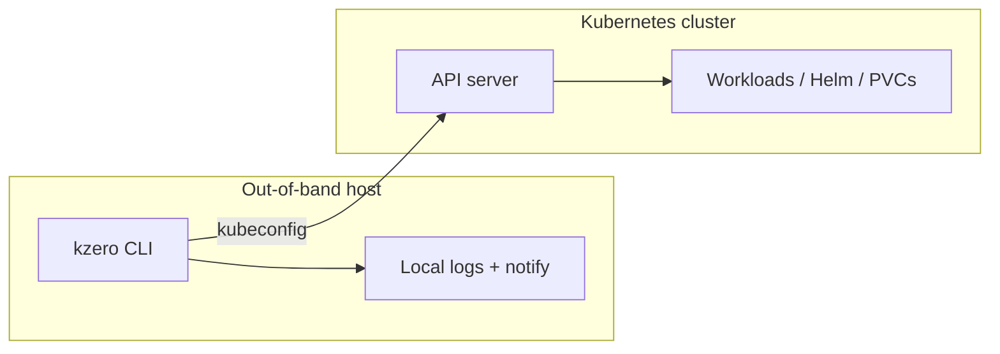
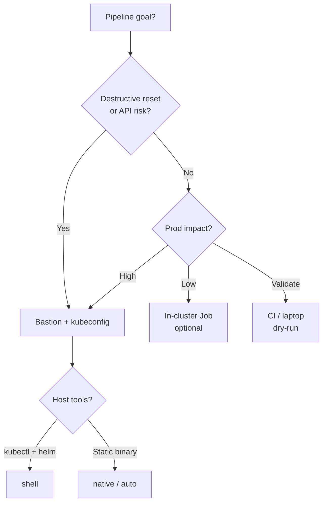

# Deployment models — bastion-first (out-of-band control)

<a id="top"></a>

kzero **orchestrates** a Kubernetes cluster from **outside** the workloads it manages. The **recommended** production model is **out-of-band**: a host that can reach the API server even when application pods are unhealthy, scaled to zero, or the data plane is mid-reset.

This document is the operator-facing source of truth for **where** to run kzero. It complements:

- **[SPECIFICATIONS.md](../SPECIFICATIONS.md)** — config contract and engine behavior
- **[examples/pipeline-network-loss.md](examples/pipeline-network-loss.md)** — API and bastion network loss during live **`reset`**
- **[kzero-selfhosted](https://github.com/hrodrig/kzero-selfhosted)** — bastion, cron, wrappers, and annotated profiles

---

## Quick decision matrix

| Scenario | Recommended | Alternative |
|----------|-------------|-------------|
| Production **`reset`** / destructive work | **Bastion / management VM** | — |
| Recovery when API or network may fail | **Bastion only** | — |
| CI / pre-merge validation | CI runner with kubeconfig | — |
| Non-critical scheduled scale-down | **Bastion** (preferred) | In-cluster Job (acceptable) |
| Air-gapped / strict security | Bastion + **`run.execution: native`** | — |

[↑ Back to top](#top)

---

## Why out-of-band

kzero is built for **maintenance and recovery**: ordered **`down`**, **`up`**, and **`reset`** when operators need predictable, repeatable control. If the control plane or cluster network is degraded:

- A **Pod running kzero inside the cluster** shares the same API path, scheduling, and network as the workloads being reset.
- When the API is unreachable, an in-cluster Job cannot reliably finish, alert, or leave a local audit trail on the management host.
- The **0.8.x** resilience band (API watchdog, **`pipeline.stalled`**, notify **`[ERR]`**, reset phase-boundary preflight) assumes a process that can still **log locally** and optionally **notify** when the API path fails — patterns documented from **bastion** incidents.

**Rule of thumb:** run kzero on infrastructure you trust **more** than the cluster you are resetting, not **inside** the cluster you are tearing down.

[↑ Back to top](#top)

---

## Recommended: bastion / management host

| Aspect | Guidance |
|--------|----------|
| **Hosts** | Dedicated bastion, management VM, CI runner with kubeconfig, or admin laptop on a stable network path to the API |
| **Scheduling** | **cron**, **systemd timer**, or manual invocation — see [kzero-selfhosted/run/](https://github.com/hrodrig/kzero-selfhosted/tree/main/run). Optional: **`kubectl kzero …`** when **`kubectl-kzero`** is on **`PATH`** (**0.9.x #52**). |
| **Credentials** | **`run.kubeconfig`** pointing at a file on the host (or **`KUBECONFIG`**) |
| **Execution** | **`run.execution: native`** (default when omitted) or **`auto`** / opt-in **`shell`** — native reduces host **`kubectl`** / **`helm`** dependencies on the **same bastion** |
| **Destructive work** | **`reset`**, **`down`** with **`pvc`**, Helm uninstall, long **`helm --wait`** — **always** out-of-band |
| **Audit** | Tee stdout/stderr to disk ([`run-kzero`](https://github.com/hrodrig/kzero-selfhosted/blob/develop/run/examples/full-reset-example/run-kzero)); enable **`run.api_watchdog`** and **`notify.*`** for live runs |
| **Examples** | [full-reset-example](https://github.com/hrodrig/kzero-selfhosted/tree/main/run/examples/full-reset-example), [pipeline-network-loss.md](examples/pipeline-network-loss.md) |



[↑ Back to top](#top)

---

## Supported: CI and developer machines

Use for **`analyze`**, **`dry-run`**, **`notify test`**, and non-production **`up`** / **`down`**:

- **kind** / test clusters — see [kzero-selfhosted/testing/kind/](https://github.com/hrodrig/kzero-selfhosted/tree/main/testing/kind)
- Pipeline validation in CI before promoting YAML to a bastion profile

CI validates **config and behavior**; it does not replace a bastion for production **`reset`**.

[↑ Back to top](#top)

---

## Optional: in-cluster Job / CronJob

> **Important:** During a destructive **`reset`**, if the API server or cluster network fails, an in-cluster Job may terminate without a reliable **external** audit trail or notification. Logs inside the Pod can be lost with the workload. Use a **bastion** for any operation that requires high reliability, local log retention, and outbound alerts when the control plane path degrades.

The engine supports **`rest.InClusterConfig()`** when **`run.kubeconfig`** is empty (see [SPEC — in-cluster auth](../SPECIFICATIONS.md#runkubeconfig-and-in-cluster-auth)). The **distroless** image and **`run.execution: native`** exist so a Job **can** run without host **`kubectl`** — that is **packaging convenience**, not the recommended resilience model.

| Use in-cluster for | Avoid in-cluster for |
|--------------------|----------------------|
| Non-destructive **`up`** when API health is trusted | **`reset`** or destructive **`down`** during incidents |
| Scheduled scale-down of non-critical tiers | Recovery when control plane or network is uncertain |
| Smoke tests and integration fixtures | Sole orchestrator when API loss is a realistic failure mode |

**If you still run in-cluster:**

- Prefer **`run.execution: native`** (no shell in distroless image).
- Use declarative **`pvc`**, **`exec`**, and Helm SDK **`release.*`** — not host-only **`custom:`** shell hooks.
- Mount pipeline YAML via ConfigMap/Secret; grant RBAC per **step namespace**.
- Treat notify and watchdog as **best-effort** — when the bastion path is gone, **in-cluster logs may be lost** with the Pod.

Operator manifests (optional): [kzero-selfhosted `run/in-cluster/`](https://github.com/hrodrig/kzero-selfhosted/tree/main/run/in-cluster).

[↑ Back to top](#top)

---

## Choosing `run.execution` (any host)

| Mode | Typical host | Notes |
|------|--------------|-------|
| **`shell`** | Bastion with **`kubectl`** and **`helm`** on **`PATH`** | Default; **`release.*`** via **`<helm.workspace>/<name>.sh`** |
| **`native`** | Bastion **or** distroless Job | client-go + Helm SDK; no host **`kubectl`** for built-in steps |
| **`auto`** | Mixed environments | Native with shell fallback |

**Native on a bastion** is often the sweet spot: single static binary, full maintenance pipeline, **out-of-band** control.

[↑ Back to top](#top)

---

## Docker image

`ghcr.io/hrodrig/kzero` is a **distroless** static binary. The **primary** use on a management host is **`docker run`** with kubeconfig mounted — same out-of-band posture as a native binary install:

```bash
docker run --rm \
  -v "${HOME}/.kube:/home/nonroot/.kube:ro" \
  -v "$(pwd)/kzero.yaml:/config/kzero.yaml:ro" \
  -e KUBECONFIG=/home/nonroot/.kube/config \
  ghcr.io/hrodrig/kzero:v0.9.0 \
  down --config /config/kzero.yaml
```

Adjust paths, tags, and volume mounts for your environment. Live runs need network reachability to the API server from the **host** running Docker, not from inside the cluster under test.

**Security note:** Mount kubeconfig and config volumes **read-only** (`:ro`). The published image runs as **nonroot** (distroless); do not override the user to root unless your policy requires it and you accept the extra risk.

The image may also run as an optional in-cluster Job; that is **not** the recommended model for production **`reset`**. See [kzero-selfhosted/run/docker/](https://github.com/hrodrig/kzero-selfhosted/blob/main/run/docker/README.md).

[↑ Back to top](#top)

---

## Decision flow



[↑ Back to top](#top)

---

## Related roadmap

**0.9.x** hardening (bastion-first docs, graceful shutdown on management hosts, E2E from selfhosted) is tracked in [ROADMAP.md](../ROADMAP.md). **1.0.0** remains the semver band for stable executor defaults and integration-test policy.

[↑ Back to top](#top)
