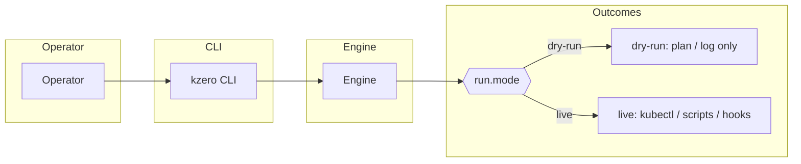
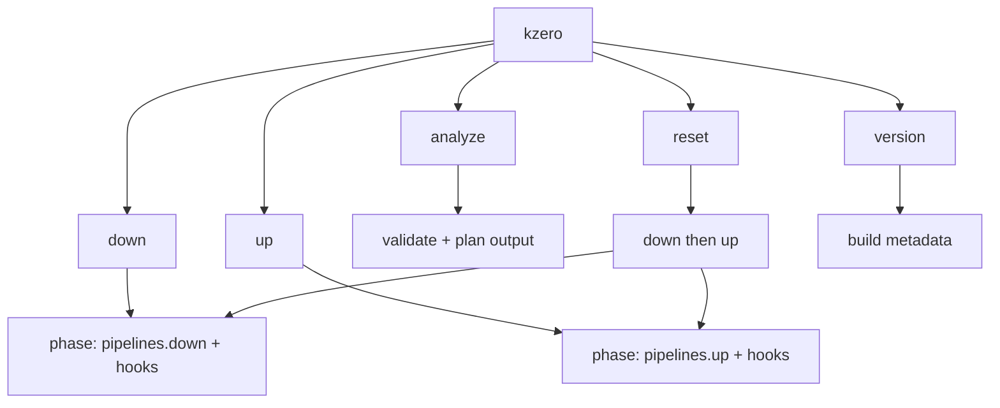
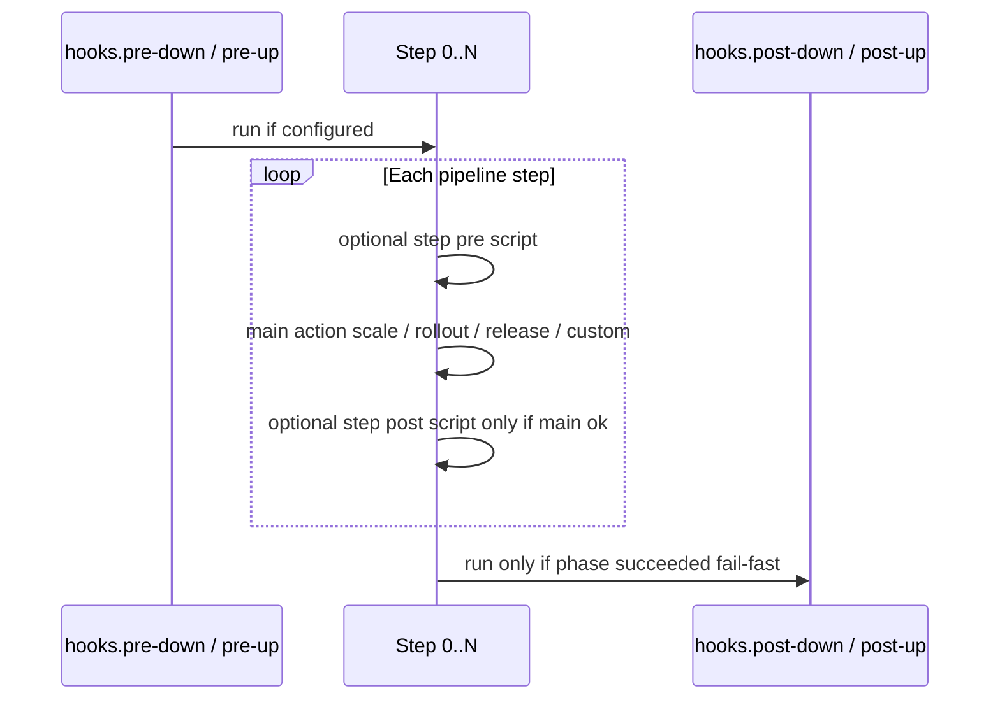
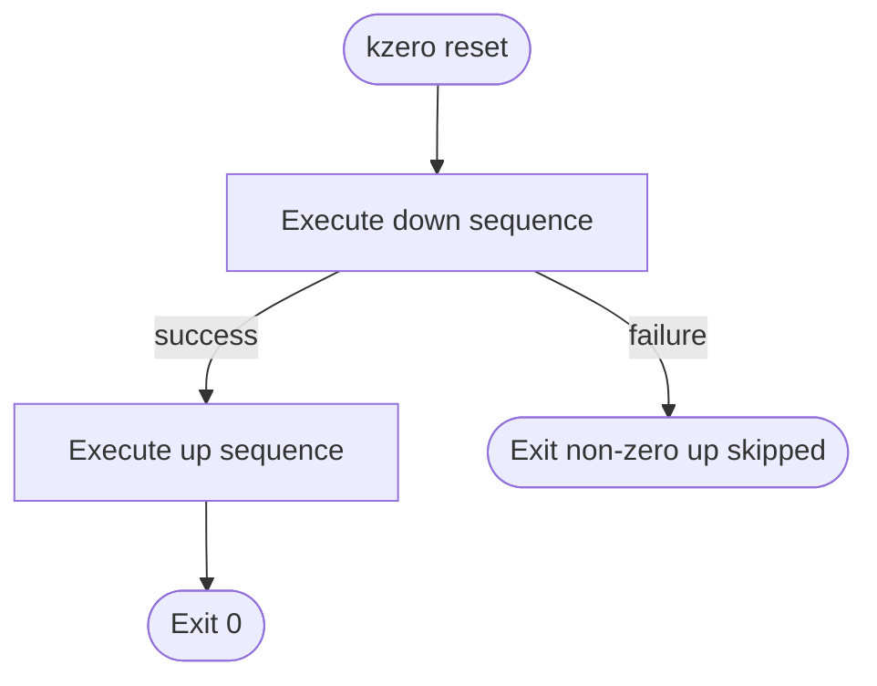
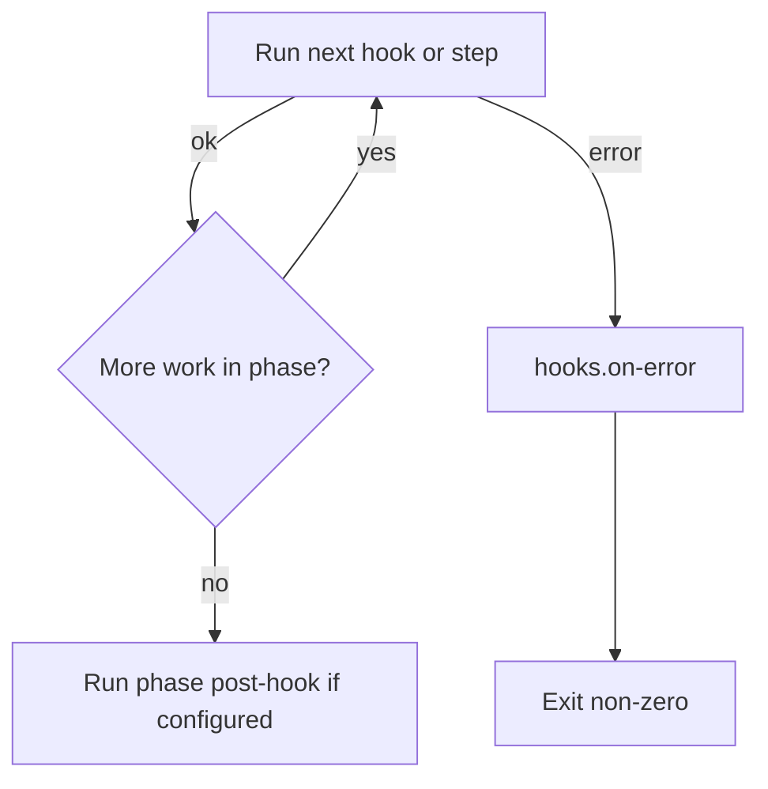
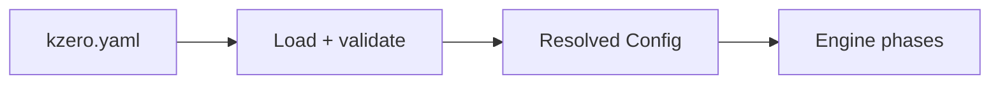

# kzero diagrams (Mermaid)

Visual complements to [SPECIFICATIONS.md](SPECIFICATIONS.md). All diagrams describe the **v1** CLI and engine contract.

## 1. CLI and engine (high level)

`kzero` is a **CLI**: operators invoke subcommands; the **engine** loads YAML, validates, and runs phases. **Live** mode executes external tools (`kubectl`, Helm helper scripts, shell hooks); **dry-run** records the plan without mutating the cluster.

## 2. Subcommands

## 3. Phase hooks and one pipeline step (`down` or `up`)

Global phase hooks wrap the whole pipeline list. Each list item may run **per-step** `pre` → **main action** → `post` (see SPECIFICATIONS §3).

## 4. `reset` = full `down` then full `up`

If **down** fails, **up** must not run (SPECIFICATIONS §4 / §5).

## 5. Fail-fast and `on-error` (simplified)

Any failing hook or step aborts the current phase. `hooks.on-error` runs per the failure policy; phase `post-*` hooks do not run after a failed phase.

## 6. Configuration file (conceptual)

The process reads a single YAML file (`--config` / default `kzero.yaml`). Viper supplies env overrides where implemented.

---

To edit diagrams: change the fenced `mermaid` blocks in this file; keep prose in **English** per repository conventions.
