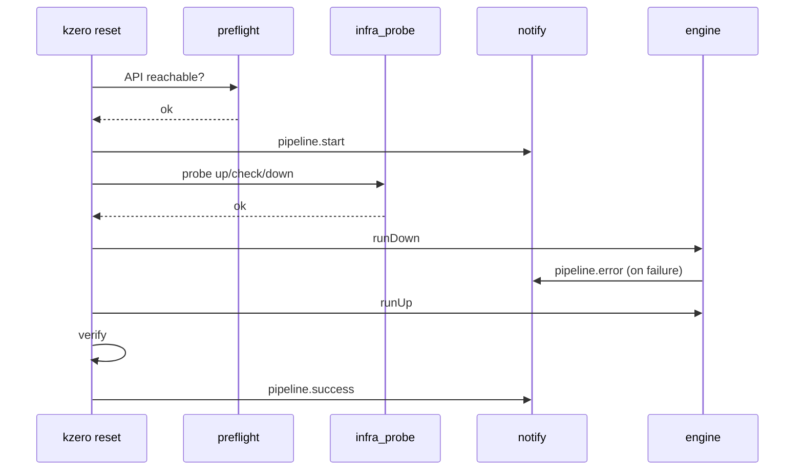

# Plan 0.6.0 — operator-ready band

**Status:** in progress — **PR1–PR4** shipped on `develop`; next **PR5** (infra probe); merge order below  
**Target release:** `v0.6.0` on `main` after `make release-check`  
**Roadmap band:** [ROADMAP.md](ROADMAP.md) **0.6.x** items **#16–#22** (+ **#22bis** SPEC doc); remainder may continue as **0.6.1+**

### Internal merge order (operator review, 2026-06-05)

After **PR1** (audit, smallest slice), prioritize **visible operator value** and **dependencies**:

1. **notify** — best work/impact ratio; Slack/Discord already in schema; same `Notifier` interface for Teams/PagerDuty/generic webhook  
2. **slog** — before **verify**, so readiness output is JSON-native from day one (avoid Fprintf rewrite)  
3. **verify** — reuses `LiveRunner` + cluster target; structured report + distinct exit codes  
4. **infra probe** — most experimental; inherits structured logger if **slog** lands first  
5. **preflight** + release polish — API gate does not block the above; ship before tag **0.6.0**

**Also in 0.6 (before 0.7 Helm SDK):** document the **Helm workspace** contract in SPEC (**#22bis**) while flat `<release>.sh` behavior is still stable.

## Why 0.6.0

After **0.5.x** (motor, retry, audit, subprocess taxonomy), the gap for production adoption is **operator surface**:

1. **Notifications** when pipelines start/end/fail  
2. **Confidence** before and after mutations (preflight, verify, infra probe)  
3. **Structured logs** for cron/CI  
4. **Operator identity** beyond `client.id`

**Helm SDK**, native `exec`/`pvc`, and scheduling/affinity checks stay in **0.7.x** (see [ROADMAP.md](ROADMAP.md)).

## Success criteria (0.6.0)

| # | Criterion | Roadmap |
|---|-----------|---------|
| 1 | At least one enabled `notify.*` channel sends on pipeline **start** and **end**; optional on **error** | #18 |
| 2 | `kzero down` / `up` / `reset` run **preflight** (API reachable) before first mutation in **live** mode | #19 |
| 3 | **`Kubernetes target:`** prints `os_user` and `os_uid`; hooks get `KZERO_OS_USER` / `KZERO_OS_UID` | #20 |
| 4 | **`kzero verify`** (or `run.verify` after `up`) emits structured report; non-zero exit on failed checks | #21 |
| 5 | **`kzero probe`** runs optional `infra_probe` mini-pipeline before destructive `down`/`reset` | #22 |
| 6 | **`--log-format text\|json`** on pipeline commands; JSON lines include phase, step, outcome | #16 |
| 7 | Deferred warnings removed for implemented `notify.*` channels | #18 |
| 8 | Total coverage ≥ 80%; `make release-check` green | — |

**Deferred to 0.6.1+ (same band, not blocking 0.6.0 tag):**

- **#17** full secret redaction and `--no-env-passthrough` (ship minimal webhook URL redaction in notify first)

---

## Implementation order (PR-sized slices)

Merge to **`develop`** in this order. Each PR must pass `make lint`, `make test`, `make cover-check`.

| PR | Item | Roadmap |
|----|------|---------|
| PR1 | Operator audit | #20 |
| PR2 | Notify | #18 |
| PR3 | slog | #16 |
| PR4 | Verify | #21 |
| PR5 | Infra probe | #22 |
| PR6 | Preflight + SPEC Helm workspace + release **0.6.0** | #19, #22bis |

### PR1 — Operator audit (#20)

**Scope:** smallest, no new commands.

- `internal/cluster/target.go`: add `os_user`, `os_uid` to `Kubernetes target:` block  
- `internal/correlation`: `KZERO_OS_USER`, `KZERO_OS_UID` in hook/script env  
- Tests: `cluster/target_test.go`, hook env test  
- SPEC + sample YAML comment  

**Acceptance:** `kzero target` shows OS fields; hook echo script prints env vars.

---

### PR2 — Notify (#18)

**Scope:** new `internal/notify` package; HTTP outbound only (no SDK deps).

**Schema extension** (`internal/config/types.go`):

```yaml
notify:
  on_error: true          # default true when any channel enabled
  slack:
    enabled: false
    webhook_url: ""
  teams:
    enabled: false
    webhook_url: ""
  pagerduty:
    enabled: false
    routing_key: ""       # Events API v2
  webhook:
    enabled: false
    url: ""
    headers: {}           # optional map[string]string
  discord:
    enabled: false
    webhook_url: ""
```

**Events:**

| Event | When |
|-------|------|
| `pipeline.start` | After preflight (PR6), before first pipeline step; until PR6 merges, after target print |
| `pipeline.success` | After `post-down` / `post-up` / full `reset` |
| `pipeline.error` | On fail-fast (before `on-error` hook); include step ref + error summary |

**Payload (all channels):** JSON body with `event`, `command` (`down`/`up`/`reset`), `client_id`, `cluster.name`, `started_at`, `duration`, `mode`, optional `failed_step`. **Redact** webhook URLs and routing keys from engine logs.

**Engine hooks:** `notify.Dispatch(ctx, cfg, event, meta)` from `engine.go` (`finishWithError`, success paths).

**CLI:** remove deferred warnings for implemented channels; warn only for enabled-but-unknown keys.

**Acceptance:** integration test with `httptest.Server` records POST; **`kzero notify test`** sends to enabled channels without running a pipeline; live E2E manual with Slack webhook test channel.

---

### PR3 — slog (#16)

**Scope:**

- Global flag `--log-format text|json` on `down`, `up`, `reset`, `probe`, `verify`  
- `internal/log` wrapper: structured fields (`command`, `phase`, `step`, `ref`, `err`)  
- Pipeline timing line remains human-readable in `text` mode  
- Notify payloads and engine paths should log through the same wrapper where practical  

**Acceptance:** `kzero --log-format json up` emits one JSON object per major event; cron can parse.

**Rationale:** lands **before verify** so readiness reports and probe output do not start as ad-hoc `Fprintf` paths.

---

### PR4 — Verify (#21)

**Scope:** new subcommand `kzero verify`.

```yaml
verify:
  enabled: true           # when true, reset/up optionally auto-run verify (see below)
  checks:
    - workloads_ready     # deployment/statefulset refs from pipelines.up at desired replicas
    - nodes_ready         # all nodes Ready
  format: text            # text | json
```

- `kzero verify --config …` runs checks without mutations  
- Optional: `run.verify: true` runs verify after successful `up` / `reset` up-phase (exit non-zero on failure)  
- JSON schema documented in SPEC § verify  

**Acceptance:** `kzero verify` exits 1 when a referenced deployment is not ready; JSON output parseable.

---

### PR5 — Infra probe (#22)

**Scope:** gate before destructive operations; reuses existing engine.

```yaml
infra_probe:
  enabled: false
  before: ["reset", "down"]   # default ["reset"] if enabled
  fail_fast: true
  cache_ttl: 0                # 0 = always run; e.g. 30m skip if last probe OK
  pipeline:
    up:
      - release.<ns>/probe-storage
    down:
      - release.<ns>/probe-storage
  checks:
    - pvc_bound: <claim-name>  # optional list
    - release_ready: true       # helm --wait succeeded on probe up
```

- New command: **`kzero probe`** — runs probe `up` → checks → probe `down`  
- **`kzero reset` / `down`**: if `infra_probe.enabled` and command in `before`, run probe first (live only)  
- Cache: timestamp file in `run.probe_cache_dir` or temp (documented); optional  
- Example probe chart: document in `docs/examples/` (operator maintains chart in `helm.workspace`)  

**Acceptance:** with failing StorageClass, probe fails and `reset --live` never starts main `down`; with good cluster, probe passes and main pipeline runs.

**Note:** probe uses **shell** helm/scripts until **0.7.x** Helm SDK; acceptable for 0.6.0.

---

### PR6 — Preflight (#19) + Helm workspace SPEC (#22bis) + release

**Preflight** (live mode only; dry-run prints plan line only):

- `internal/engine/preflight.go`: `List` nodes (or `ServerVersion` + namespace GET) via client-go when kubeconfig loads  
- Call from `Engine.runDown` / `runUp` **before** `pre-down` / `pre-up` hooks in **live**  
- Clear error: `preflight: cannot reach Kubernetes API: …`  
- `analyze`: optional warning if preflight would fail (reuse validate client factory pattern)  

**Helm workspace contract** ([SPECIFICATIONS.md](SPECIFICATIONS.md) new section):

- Flat `<helm.workspace>/<release-name>.sh` resolution (`release.<ns>/<name>` step → script basename = release **name**)  
- Required env (`KZERO_PHASE`, `KZERO_RELEASE_*`, correlation vars)  
- What **0.7.x** Helm SDK may extend (hierarchical paths, values files, OCI auth) without silently breaking today's flat layout  

**Release polish:** README + CHANGELOG for **0.6.0**; deferred-warnings cleanup for any remaining notify keys.

**Acceptance:** wrong kubeconfig fails fast in live; SPEC documents workspace rules; `make release-check` green.

---

## Release 0.6.0

1. Complete PR1–PR6 on `develop`  
2. Update [ROADMAP.md](ROADMAP.md) Shipped row + tick items  
3. `VERSION` → `0.6.0`; CHANGELOG; README badge  
4. `make port-freebsd-sync` + `make port-openbsd-sync`  
5. Re-record VHS if CLI output changed materially  
6. Merge `develop` → `main`; tag `v0.6.0`  

---

## Test strategy

| Area | Approach |
|------|----------|
| notify | `httptest` + golden payload fixtures |
| slog | capture stdout, `json.Valid` per line in json mode |
| verify | fake clientset with ready/not-ready deployments; JSON schema matches slog fields |
| infra_probe | engine test with stub Runner; integration optional in kzero-all pilot |
| preflight | fake clientset / unreachable kubeconfig |
| OS audit | unit tests only |
| Helm workspace SPEC | review only (no engine change in 0.6.0) |

---

## Diagram (0.6.0 live `reset` with all features enabled)



---

## References

- [SPECIFICATIONS.md](SPECIFICATIONS.md) — update per PR  
- [configs/kzero.sample.yml](../configs/kzero.sample.yml) — new blocks  
- Operator pilot notes (private): infra probe design in operator config repos  
