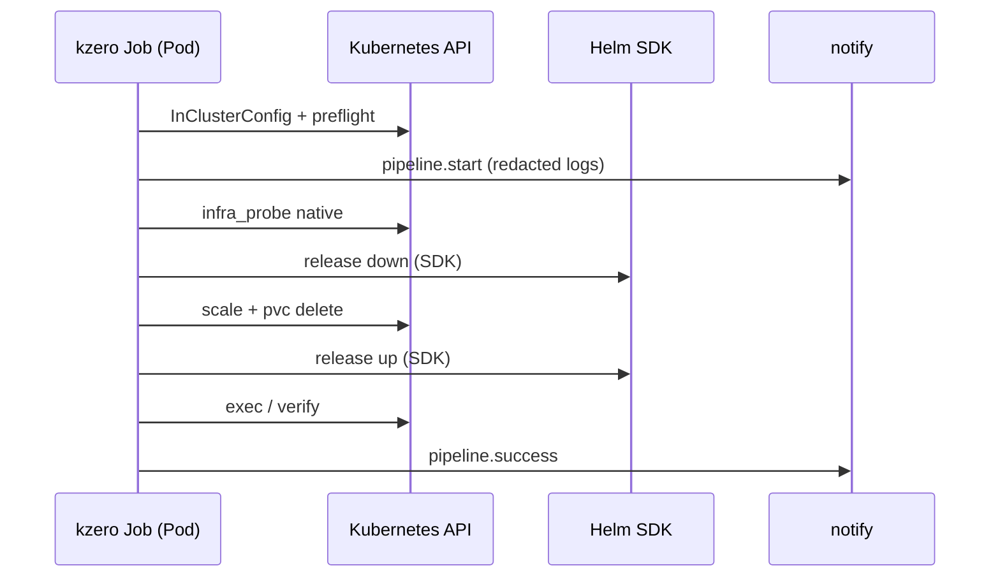

# Plan 0.7.x — native cluster ops, Helm SDK, and operator safety

**Status:** in progress on `develop`  
**Shipped:** **`v0.7.0`** on `main` — **#28** Cosign signing + SBOM only  
**On `develop` (unreleased):** InClusterConfig fallback + in-cluster target block (in-cluster Job smoke validated via [kzero-selfhosted](https://github.com/hrodrig/kzero-selfhosted) `make test-kind-in-cluster`)  
**Target band:** [ROADMAP.md](ROADMAP.md) **0.7.x** items **#17** (carry-over from **0.6.x**), **#23–#27**, **#29–#31**

### Internal merge order (2026-06-11)

Close **0.6.x #17** first (small, operator-facing, unblocks safer logs before larger executors). Then ship **in-cluster** as a tagged patch, then **Helm SDK** (largest slice), then **`pvc` / `exec` / probe native** for develop2-style distroless pipelines.

1. **Secret redaction + env passthrough** — finish **#17** deferred from [plan-0.6.0.md](plan-0.6.0.md)  
2. **In-cluster auth** — release polish for merged `LoadRESTConfig` / target in-cluster (tag **0.7.1**)  
3. **Helm SDK** — **#25**; closes distroless gap for **`release.*`**  
4. **`pvc` delete** — **#24**; data-reset pipelines without host `kubectl`  
5. **`exec` step type** — **#23**; replaces many shell hooks in-cluster  
6. **Infra probe (native)** — **#26**; probe without shell scripts in the GHCR image  
7. **Scheduling / affinity sanity** — **#27**; optional verify/probe extension  
8. **Extended step types + ergonomics** — **#29–#31** as pilot demand; tag when band criteria met  

**Also before closing 0.7.x:** update **ROADMAP** “Last reviewed”, **selfhosted** in-cluster docs when RBAC/rules change for Helm/`exec`/`pvc`.

---

## Why 0.7.x

After **0.6.x** (notify, verify, probe, preflight, structured logs), operators need:

1. **Distroless / in-cluster** runs without bastion kubeconfig mounts  
2. **`release.*`** without host **`helm`** + **`.sh`** scripts (**Helm SDK**)  
3. **Data reset and maintenance** primitives (**`pvc`**, **`exec`**) without shell in the image  
4. **Safer logs and hooks** — complete **#17** (only notify URL redaction exists today)

**1.0.0** items (**default native**, PVC strategy doc, product-repo kind CI) stay in [ROADMAP.md](ROADMAP.md) **1.0.0**.

---

## #17 — current state vs plan (important)

| Area | Today | **#17** target |
|------|--------|----------------|
| Notify HTTP **errors** | `redactURL()` masks webhook URLs in error strings | Keep; extend to routing keys in error text |
| Notify **payloads** | `Meta.Error` copied verbatim into JSON | Redact tokens/URLs before POST |
| Engine **logs** (`text` / `json`) | No general secret scrubbing | Scrub known patterns before write (URLs with creds, `Bearer`, common `*_TOKEN` / `*_KEY` env echoes) |
| Hook / subprocess **environment** | Full `os.Environ()` passed to hooks and release scripts | Optional **`--no-env-passthrough`** + `run.no_env_passthrough: true` → only `KZERO_*`, `KUBECONFIG` (if set), and explicit config env |

**Already shipped (0.6.x PR2):** minimal notify URL redaction only — **#17 is not closed** in [ROADMAP.md](ROADMAP.md).

---

## Success criteria (0.7.x band)

| # | Criterion | Roadmap |
|---|-----------|---------|
| 1 | Empty **`run.kubeconfig`** in a Pod uses in-cluster SA; **`Kubernetes target:`** shows `in-cluster` block | (enabler; on `develop`) |
| 2 | **`--no-env-passthrough`** / config flag documented; hooks do not inherit host secrets when enabled | **#17** |
| 3 | Notify payloads and engine error logs scrub webhook URLs, routing keys, and common secret patterns | **#17** |
| 4 | **`release.*`** live **up**/**down** via **helm.sh/helm/v3** (install/uninstall + wait); analyze shows SDK plan | **#25** |
| 5 | **`pvc`** step deletes named PVCs via API | **#24** |
| 6 | **`exec`** step runs command in pod/container via remotecommand | **#23** |
| 7 | **`infra_probe`** checks runnable with native step types (no probe `.sh` required) | **#26** |
| 8 | Optional: pods **Pending** due to selectors/taints surfaced in verify or probe | **#27** |
| 9 | Total coverage ≥ 80%; `make release-check` green on each release tag | — |

**In-cluster PO readiness (scale-only):** criteria **1** + [kzero-selfhosted `run/in-cluster/`](https://github.com/hrodrig/kzero-selfhosted/tree/develop/run/in-cluster) — met after **0.7.1** tag.

**develop2-full in-cluster (distroless):** criteria **4–7** minimum.

---

## Implementation order (PR-sized slices)

Merge to **`develop`** in this order. Each PR: `make lint`, `make test`, `make cover-check`.

| PR | Item | Roadmap | Notes |
|----|------|---------|--------|
| PR1 | Secret redaction + env passthrough | **#17** | Close 0.6.x carry-over |
| PR2 | In-cluster release (**0.7.1**) | — | CHANGELOG, SPEC note, ROADMAP; image tag |
| PR3 | Helm SDK MVP | **#25** | uninstall + upgrade --install + wait |
| PR4 | **`pvc`** step | **#24** | |
| PR5 | **`exec`** step | **#23** | |
| PR6 | Infra probe native | **#26** | |
| PR7 | Scheduling sanity + **#29–#31** (as needed) + band close | **#27**, **#29–#31** | Tag **0.7.x** when pilot-ready |

---

### PR1 — Secret redaction and env passthrough (#17)

**Scope:** shared redaction helper; no new step types.

**New / changed:**

- `internal/redact` (or extend `internal/notify`): `RedactString(s string) string`, `RedactURL`, patterns for `Bearer …`, basic `key=value` secret env echoes  
- **Notify:** redact `Meta.Error` and routing keys in logged failures before `buildPayload` / `joinErrors`  
- **Engine / slog:** run subprocess hook output and structured error fields through redactor when writing logs  
- **CLI:** global flag **`--no-env-passthrough`** on `down`, `up`, `reset`; config **`run.no_env_passthrough: true`**  
- **`LiveRunner.envFor`:** when passthrough off, start from empty slice + `correlation.AppendEnv` + optional `KUBECONFIG` only  

**SPEC:**

- Document flag and config; list what hooks still receive (`KZERO_*` table unchanged)  
- Warn that passthrough off may break hooks that relied on host `PATH` / cloud creds — intentional  

**Acceptance:**

- Unit tests: redact webhook URL, `Bearer abc`, `SLACK_WEBHOOK_URL=https://…` in log lines  
- Hook test: with passthrough off, subprocess env lacks `HOME`/`USER` but has `KZERO_PHASE`  
- `make cover-check` green  

---

### PR2 — In-cluster auth release (0.7.1)

**Scope:** release-only for code already on `develop` (`LoadRESTConfig`, `targetFromInCluster`, selfhosted smoke).

- **CHANGELOG** `[0.7.1]`: InClusterConfig when `run.kubeconfig` empty  
- **SPEC:** in-cluster Job note (empty kubeconfig, SA RBAC per pipeline namespace)  
- **ROADMAP:** move in-cluster enabler to Shipped or note under **0.7.1**  
- **VERSION** `0.7.1`; merge `develop` → `main`; tag **`v0.7.1`**; refresh GHCR tag in selfhosted manifests  

**Acceptance:** `make test-kind-in-cluster` passes against **`ghcr.io/hrodrig/kzero:v0.7.1`** (pull, not local build).

---

### PR3 — Helm SDK executor (#25)

**Scope:** largest PR; replaces shell **`helm`** for built-in **`release.*`** when `run.execution: native` (or new `run.helm: sdk|shell` if needed — prefer extending **`run.execution`** or explicit **`run.helm_executor`** documented in SPEC).

**MVP:**

- **Down:** `helm uninstall` equivalent with wait (matches today’s live down)  
- **Up:** `upgrade --install` with wait; values from config (minimal: chart path or OCI ref — align with develop2 pilot needs)  
- **Analyze:** show SDK operations instead of `script: …sh` when SDK path selected  
- **Tests:** helm action mocks / fake kube client patterns; no cluster required for unit gate  

**Defer within #25 (follow-up PR or 0.7.x patch):**

- OCI registry login from config (**#31** overlap)  
- Non-flat **`helm.workspace`** paths  

**Acceptance:** kind or envtest optional integration; develop2 subset runs **`release.*`** without `/bin/sh` or host `helm` in Job image.

**Operator:** extend [kzero-selfhosted `run/in-cluster/`](https://github.com/hrodrig/kzero-selfhosted) RBAC (Helm release secrets, configmaps) and sample pipeline with one probe release.

---

### PR4 — `pvc` step (#24)

**Schema:**

```yaml
pipelines:
  down:
    - pvc.database/data-postgresql-0
    - pvc.database/data-postgresql-1
```

- API delete with propagation policy documented  
- Analyze: list PVC refs; cluster validation optional Get  
- RBAC: `persistentvolumeclaims` delete in target namespaces  

**Acceptance:** fake clientset delete; kind smoke optional.

---

### PR5 — `exec` step (#23)

**Schema:**

```yaml
pipelines:
  down:
    - exec.database/postgresql-0:
        container: postgres
        command: ["psql", "-c", "TRUNCATE …"]
```

- `remotecommand` executor; timeout from step or `run.operation_timeout`  
- Analyze: pod/container ref validation when client available  

**Acceptance:** fake remotecommand test; replaces develop2 postgres truncate hook for in-cluster path.

---

### PR6 — Infra probe native (#26)

- Reuse **0.6.x #22** gate; implement checks with **`pvc`**, **`release.*` (SDK)**, **`exec`** instead of operator `.sh`  
- Selfhosted: native probe sample under `run/in-cluster/` or `run/examples/`  

**Acceptance:** `kzero probe` succeeds in Job without shell; distroless image.

---

### PR7 — Scheduling sanity (#27) + band close

- **#27:** after `up`, optional verify check or probe check for pods Pending (affinity/taints)  
- **#29–#31:** only if develop2 or pilot requires (`job`/`cronjob` suspend, `custom:` parity, helm path ergonomics)  
- **ROADMAP:** tick **#17**, **#23–#27**, **#29–#31** as shipped; **Last reviewed** date  
- Tag **`v0.7.x`** (semver TBD — e.g. **0.7.2** after Helm SDK, **0.7.3** after pvc/exec, or single **0.7.5** when develop2-full green)

---

## Release sequencing (suggested tags)

| Tag | Contents |
|-----|----------|
| **`v0.7.0`** | **Done** — Cosign + SBOM (**#28**) |
| **`v0.7.1`** | **#17** + InClusterConfig release polish |
| **`v0.7.2`** | **#25** Helm SDK MVP (or split 0.7.2 = #17+in-cluster, 0.7.3 = Helm if PR1 merges before PR2 tag) |
| **`v0.7.3+`** | **#24**, **#23**, **#26**, **#27** as merged |
| **`v0.8.0` or `1.0.0`** | Remaining **#29–#31** + **1.0.0** contract items if band splits |

**Recommended:** tag **0.7.1** after PR1+PR2; do not wait for Helm SDK — unblocks in-cluster PO track.

---

## Release checklist (each tag)

Same gate as [plan-0.6.0.md](plan-0.6.0.md) § Release 0.6.0:

1. PR merged on **`develop`**; `make release-check` green  
2. **VERSION**, **CHANGELOG**, README badge, **ROADMAP** shipped rows  
3. BSD port sync if applicable  
4. VHS demo if CLI surface changed materially  
5. Merge **`develop` → `main`**; annotated tag **`vX.Y.Z`**; push  
6. Verify GHCR image; update selfhosted manifest pin  

---

## Test strategy

| Area | Approach |
|------|----------|
| **#17** redact | Table-driven string fixtures; hook env with/without passthrough |
| In-cluster | Product unit tests + selfhosted **`make test-kind-in-cluster`** |
| Helm SDK | helm `action` package mocks; optional kind + chart fixture |
| **`pvc` / `exec`** | fake clientset + fake remotecommand |
| Probe native | engine integration with stub executors |
| develop2 pilot | Private config repo; not in product CI gate initially |

---

## Diagram (target: in-cluster live `reset` with 0.7.x features)



---

## References

- [ROADMAP.md](ROADMAP.md) — **0.7.x** / **1.0.0** bands  
- [plan-0.6.0.md](plan-0.6.0.md) — **#17** explicitly deferred  
- [SPECIFICATIONS.md](SPECIFICATIONS.md) — update per PR  
- [kzero-selfhosted run/in-cluster/](https://github.com/hrodrig/kzero-selfhosted/tree/develop/run/in-cluster) — Job/RBAC smoke  
- Handoff topic **`kzero/in-cluster-handoff`** — PO track after 0.7.1 + develop2 subset  
